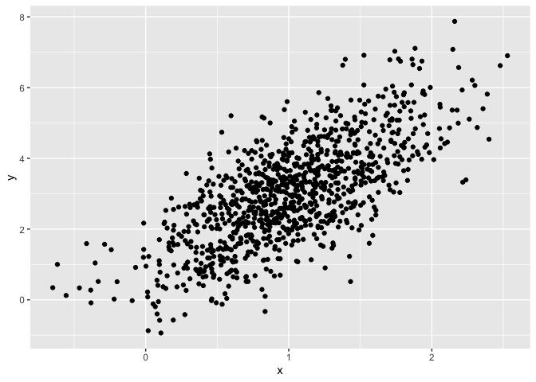
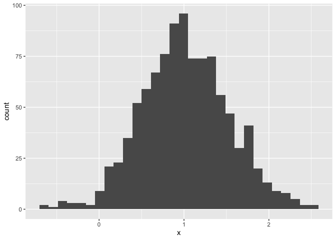

A really not so simple document
================
Jeff Goldsmith
2026-09-17

I’m an R Markdown document!

``` r
library(tidyverse)
```

# Section 1

Here’s a **code chunk** that samples from a *normal distribution*:

``` r
samp = rnorm(100)
length(samp)
```

    ## [1] 100

# Section 2

I can take the mean of the sample, too! The mean is 0.0836643.

# Section 3

This is where I’m going to talk about code chunks.

``` r
mean(samp)
sd(samp)
```

Let’s also make a dataframe.

``` r
example_df = 
  tibble(
    vec_numeric = 1:4,
    vec_char = c("My", "name", "is", "jeff"),
    vec_factor = factor(c("male", "male", "female", "female"))
  )
```

I’ll create a new dataframe.

``` r
new_df = 
  tibble(
    x = rnorm(100),
    y = 1 + 2 * x + rnorm(100)
  )
```

Let’s make a plot and see how cool that is!

``` r
plot_df = 
  tibble(
    x = rnorm(1000, mean = 1, sd = .5),
    y = 1 + 2 * x + rnorm(1000)
  )

ggplot(plot_df, aes(x = x, y = y)) + geom_point()
```

<!-- -->

This is a neat scatterplot!!!

What if I try to add a histogram?

``` r
ggplot(plot_df, aes(x = x)) + geom_histogram()
```

    ## `stat_bin()` using `bins = 30`. Pick better value `binwidth`.

<!-- -->
